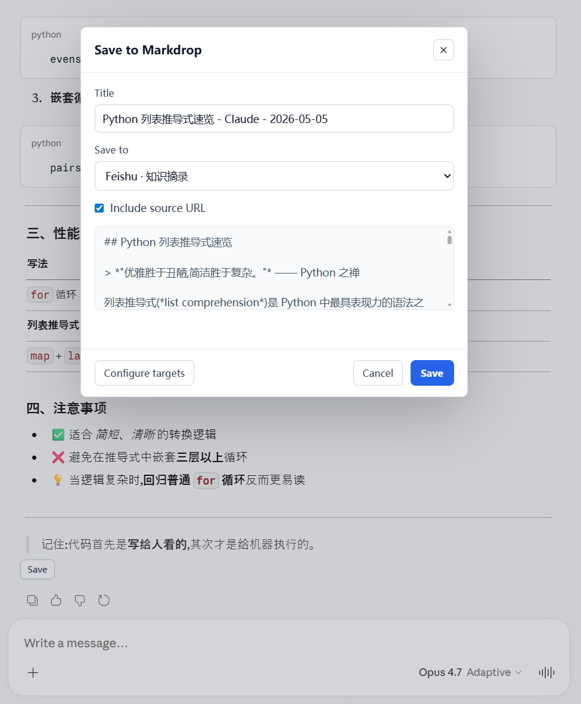
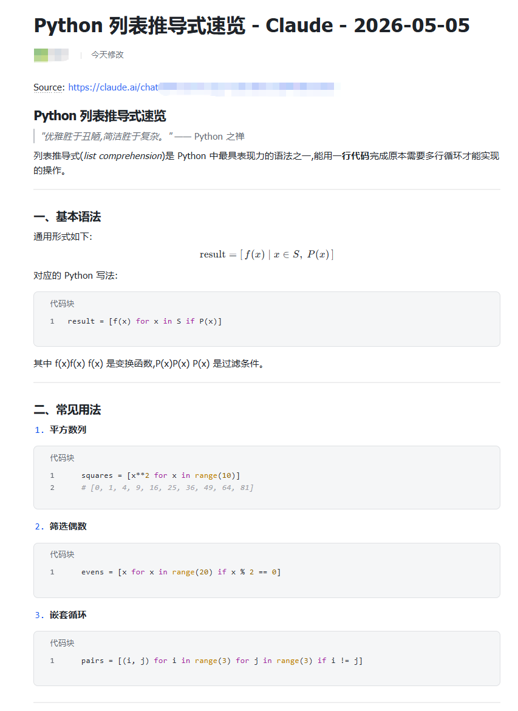

# Markdrop

[中文](README.zh-CN.md) | [English](README.en.md)

Markdrop is a local-first browser extension for saving selected web content and AI answers, including selected snippets and full answers, as structured notes.

Markdrop 是一个本地优先的浏览器扩展，用来把普通网页划词内容和 AI 回答（支持划词和整篇）保存为结构化笔记。

## Supported Destinations / 支持的保存目标

- Notion pages and data sources
- Feishu Docs folders and Feishu Wiki directories (knowledge bases)
- Obsidian vault folders through the Obsidian Local REST API plugin

## Supported AI Platforms / 支持的 AI 平台

ChatGPT, Claude, Gemini, DeepSeek, Doubao, and Qianwen.

## Screenshots / 截图

### Save AI answers / 保存 AI 回答



### Saved result / 保存结果



## Installation / 安装

For regular users, download a packaged build from GitHub Releases, unzip it, and load the unpacked extension folder in Chrome or Edge.

普通用户建议从 GitHub Releases 下载打包好的版本，解压后在 Chrome 或 Edge 中加载解压后的扩展文件夹。

For developers who want to build from source:

```bash
npm install
npm run typecheck
npm run build
```

Then load the generated `dist/` folder as an unpacked extension.

如果你想从源码构建，请运行上面的命令，然后加载生成的 `dist/` 文件夹。

## Documentation / 文档

- [中文使用说明](README.zh-CN.md)
- [English guide](README.en.md)
- [测试清单](docs/TESTING.md) / [Testing checklist](docs/TESTING.en.md)
- [安全与隐私](docs/SECURITY_AND_PRIVACY.md) / [Security and privacy](docs/SECURITY_AND_PRIVACY.en.md)
- [发布清单](docs/RELEASE_CHECKLIST.md) / [Release checklist](docs/RELEASE_CHECKLIST.en.md)

The setup guides include the full Notion, Feishu, and Obsidian configuration flow. The Feishu guide includes a batch permission-import JSON snippet for one-step permission setup.

配置文档包含 Notion、Feishu、Obsidian 的完整接入流程。Feishu 部分附带批量导入权限 JSON，方便一次性开通所需权限。
